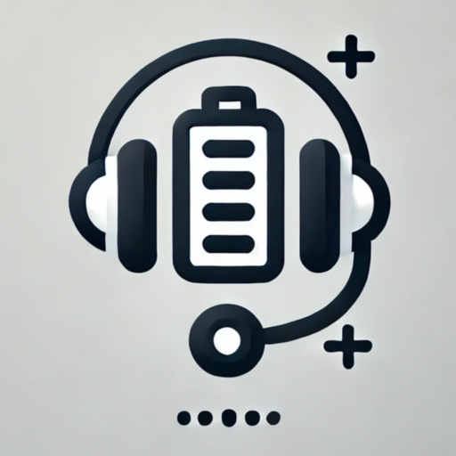

# Arctis Headset Battery - Stream Deck Plugin

A Stream Deck plugin that displays the battery level of your SteelSeries Arctis wireless headset.



## Demo


## Features

- Displays battery percentage (0-100%) with charging indicator (⚡)
- Configurable polling interval (5-60 seconds, default: 15s)
- Force fetch battery status by pressing the key
- Visual indicator when headset is disconnected (-)
- Automatic charging detection when connected via USB

## Usage

1. Add the "Battery Level" action to your Stream Deck
2. The key will display:
   - Battery percentage and charging icon when connected (e.g., "100% ⚡")
   - Charging icon only ("⚡") when disconnected but charging via USB
   - Dash ("-") when disconnected and not charging
3. Press the key at any time to force an immediate battery status update
4. Configure the polling interval in settings (default: 15 seconds)

## Supported Devices

- SteelSeries Arctis 7 (2019 Edition) - Verified
  - Product ID: `0x12ad`
  - Vendor ID: `0x1038`
  - Usage: `514`
  - UsagePage: `65347`

The following devices are supported in code but have not been verified:

- SteelSeries Arctis 7 (2017 Edition)
  - Product ID: `0x1260`
  - Vendor ID: `0x1038`
- SteelSeries Arctis Pro
  - Product ID: `0x1294`
  - Vendor ID: `0x1038`
- SteelSeries Arctis 1 Wireless
  - Product ID: `0x12b3`
  - Vendor ID: `0x1038`

## Installation

1. Clone this repository
2. Install dependencies:
   ```bash
   npm install
   ```
3. Build the plugin:
   ```bash
   npm run build
   ```
4. Set Stream Deck to developer mode
   ```
   streamdeck dev
   ```
5. Link the plugin
   ```
   streamdeck link com.0xjessel.arctis-headset-battery.sdPlugin
   ```
6. Restart the plugin
   ```
   streamdeck restart com.0xjessel.arctis-headset-battery
   ```

## Development

- `npm run build` - Build the plugin
- `npm run watch` - Build and watch for changes, automatically restart the plugin
- `npm run read:battery` - Test script to read battery status directly

## Testing

You can test the battery reading functionality without installing the Stream Deck plugin:

```bash
npm run read:battery
```

This will:

1. Scan for compatible SteelSeries headsets
2. Display detailed information about all detected devices
3. Connect to the appropriate interface
4. Read and display the battery level

Example output:

```
Found SteelSeries devices:
Device 1:
  VendorID: 0x1038
  ProductID: 0x12ad
  Product: SteelSeries Arctis 7
  Usage: 1
  UsagePage: 12
Device 2:
  VendorID: 0x1038
  ProductID: 0x12ad
  Product: SteelSeries Arctis 7
  Usage: 514
  UsagePage: 65347
Successfully connected to Arctis 7 (Arctis 7 2019)
Headset: Arctis 7 (Arctis 7 2019)
Battery Level: 100%
```

## Contributing

Pull requests are welcome. For major changes, please open an issue first to discuss what you would like to change.

## License

[MIT](LICENSE)

## Technical Details

### Polling and Updates

The plugin checks the battery status in two ways:

1. Automatic polling every 15 seconds (configurable from 5-60 seconds)
2. Manual update when the user presses the key

The default 15-second polling interval was chosen to balance responsiveness with battery life and system resource usage. Users can adjust this in the settings if they prefer more or less frequent updates.

### Error Handling and Troubleshooting

The plugin includes robust error handling for various scenarios:

1. **Disconnected Headset**

   - Display shows "-" when the headset is disconnected
   - Continues polling to detect when headset becomes available
   - No error alerts to avoid disrupting the user

2. **USB Connection Issues**

   - Automatically attempts to reconnect if the USB connection fails
   - Tries multiple interfaces if the primary one isn't responding
   - Falls back to disconnected state if all attempts fail

3. **Invalid Battery Values**

   - Caps battery percentage at 100% if device reports higher values
   - Filters out invalid readings to prevent display glitches
   - Maintains last known good value until next valid reading

4. **Common Issues**
   - If the key shows "-", try pressing it to force a refresh
   - If charging detection isn't working, ensure the headset is connected directly to your PC (not through a USB hub)
   - If battery updates seem delayed, try reducing the polling interval in settings

### Headset Communication Protocol

The plugin communicates with the headset using the HID (Human Interface Device) protocol. Here's how the battery level is read:

1. **Command**: Send `[0x06, 0x18]` to the headset
2. **Response**: The headset returns a multi-byte response:
   - Bytes 0-1: Echo of the command (`0x06, 0x18`)
   - Byte 2: Battery level (0-100, sometimes >100)
   - Remaining bytes: Various status information

### Finding the Correct Interface

Not all HID interfaces on the headset support battery status reading. The plugin specifically looks for an interface with:

- Usage: `514`
- UsagePage: `65347`

This has been verified to work with the Arctis 7 2019 model, but may vary for other models.

### Battery Level

The battery level is reported in byte 2 and can sometimes exceed 100%. The plugin caps the reported value at 100% for consistency.

**Note on Battery Level Testing**: Our testing has primarily been conducted with the headset at or near 100% battery level. We haven't yet verified how the battery level is reported across the entire range (0-100%). It's possible that the Arctis 7 2019 might use a different scale (such as the 0-4 range mentioned in the [aarol.dev blog](https://aarol.dev/posts/arctis-hid/) for the Arctis Nova 7) when the battery is at lower levels. Further testing with partially discharged batteries would be needed to confirm the full behavior.

**TODO**: Test the headset at various battery levels (75%, 50%, 25%, near empty) to verify whether the Arctis 7 2019 reports battery levels as 0-100 values or uses a different scale. Update the implementation if necessary based on findings.

### Charging Status Detection

After extensive testing, we've discovered a reliable method to detect when the headset is charging via USB connected to the PC:

1. When the Arctis 7 2019 headset is connected directly to the PC via USB for charging, additional USB devices appear with:

   - Product ID: `0x12ae`
   - Product Name: `SteelSeries Arctis 7 Bootloader`
   - Vendor ID: `0x1038`

2. By detecting the presence of these bootloader devices, we can determine if the headset is currently charging via the PC's USB port.

3. **Limitations**:

   - This method only works when the headset is charging via the PC's USB port
   - It won't detect charging from other power sources (like wall adapters or power banks)
   - It requires the headset to be directly connected to the PC, not through a USB hub

4. **Advantages**:
   - This is more reliable than trying to interpret the HID response bytes
   - It provides a clear binary indication (charging/not charging) without ambiguity
   - It works regardless of whether the headset is turned on or off

This approach was developed after we found that the HID response bytes did not provide consistent charging status information.

### Note on HID Response Charging Status Detection

**Important**: Our initial attempts to determine charging status from the HID response bytes were unsuccessful for the Arctis 7 2019 model.

Our testing revealed:

1. The response bytes do not consistently indicate charging status in a way that matches expected patterns from other implementations.

2. When testing with the headset plugged in and turned on vs. unplugged and turned on, we observed inconsistent values in bytes that were expected to indicate charging status.

3. Different tests with the same physical state (plugged in or unplugged) produced different values in the response bytes.

4. No single byte in the response reliably indicated the charging state across multiple tests.

5. Our findings differ significantly from those described in [this blog post](https://aarol.dev/posts/arctis-hid/) about the Arctis Nova 7 model. The blog describes a consistent pattern for charging status in byte 3, but our tests with the Arctis 7 2019 showed inconsistent values that did not follow the described pattern.
